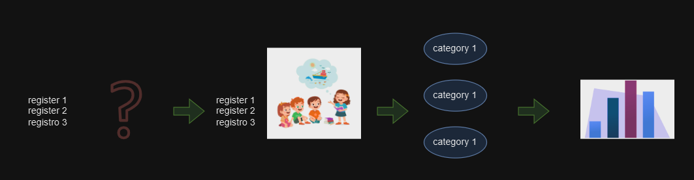
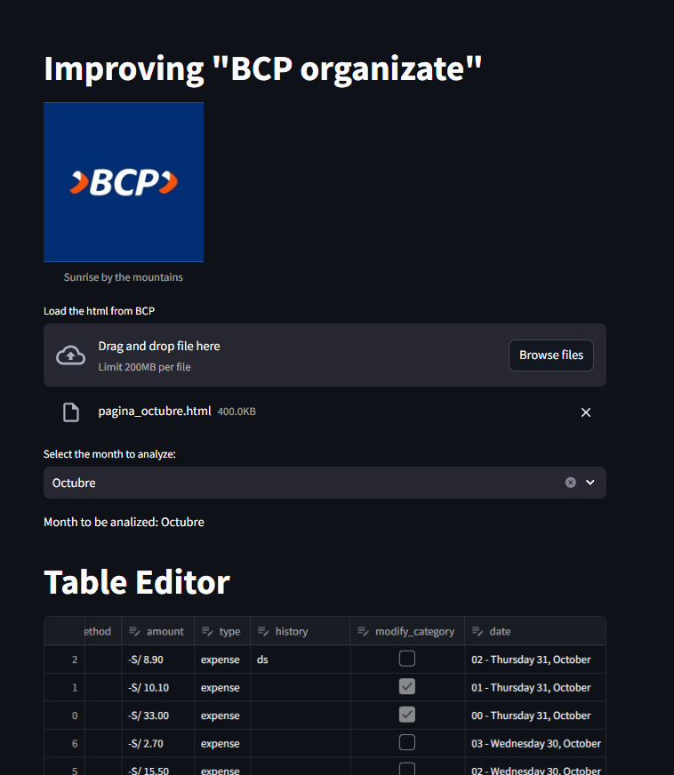

# improving-BCP-organizate





- entrar a `organizate BCP`
- copiar `Copy OuterHTML`
- ejecutar script y generar archivo csv


execute
```
streamlit run app.py 
```


# opinion
If BCP gives aditional information, for example, location and time, it would be better to create the history and clasify the expenses.
