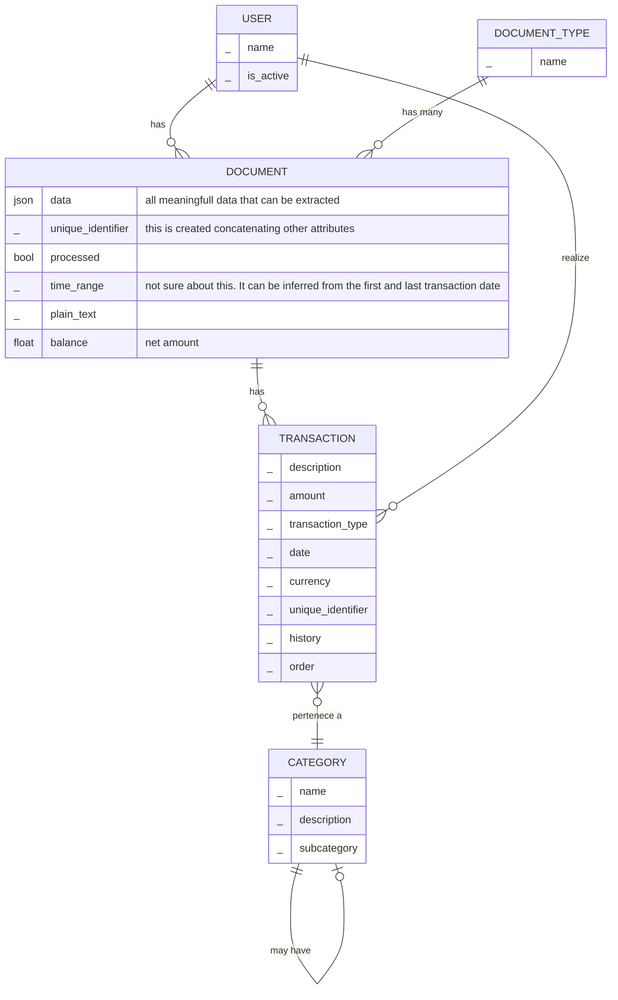
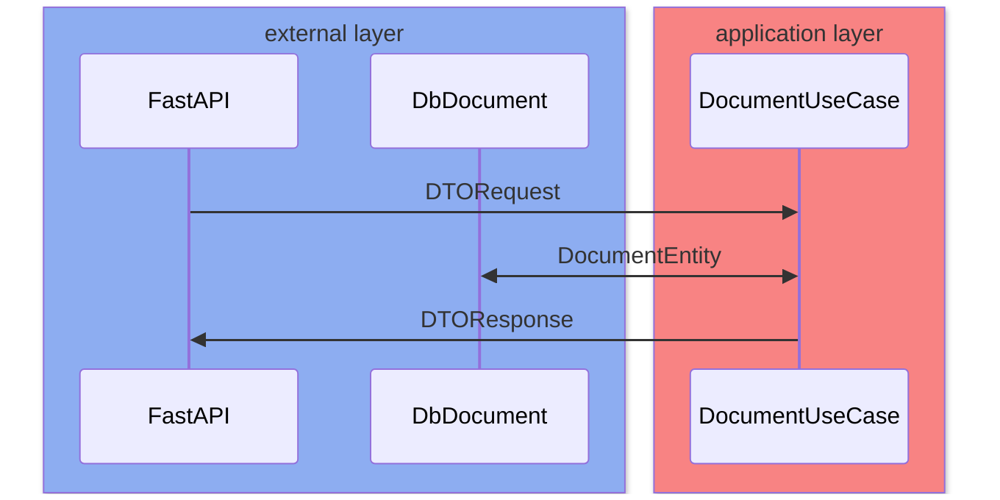
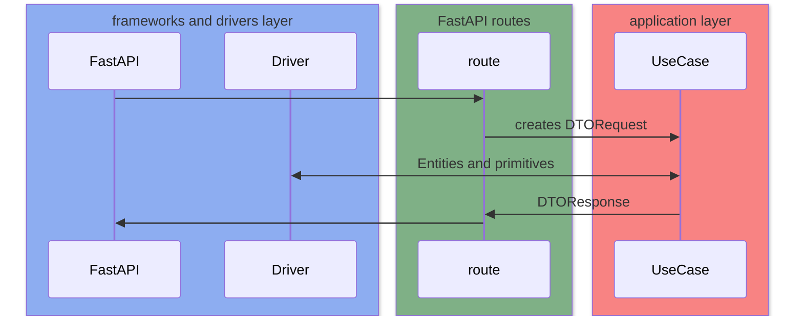
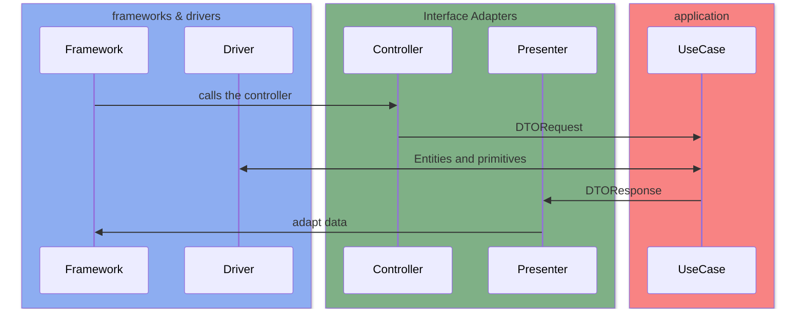

# Alternative to "BCP Organizate"

This project is meant to replace the BCP-Organizate app that was removed by BCP. 

The idea on the feature is to integrate this with other banks and currency platform.s

# How to use

This project is highly integrated with vs code. Thus, you can take advantage of the dev container features to start upgrading the code.

Start dev container and follow `README.md` file inside it


## DB design

This is the design of the application and the database

- Document: the representation of a place that stores money


```mermaid
erDiagram
    USER {
        _ name
        _ is_active
    }

    TRANSACTION {
        _ description
        _ amount
        _ transaction_type
        _ date
        _ currency
        _ unique_identifier 
        _ history
        _ order
    }

    CATEGORY {
        _ name
        _ description
        _ subcategory
    }

    DOCUMENT_TYPE {
        _ name
    }


    DOCUMENT {
        json data "all meaningfull data that can be extracted"
        _ unique_identifier "this is created concatenating other attributes"
        bool processed
        _ time_range "not sure about this. It can be inferred from the first and last transaction date"
        _ plain_text
        float balance "net amount"
    }

    %% Relaciones
    USER ||--o{ DOCUMENT : "has"
    DOCUMENT ||--o{ TRANSACTION : "has"
    USER ||--o{ TRANSACTION : "realize"
    TRANSACTION }o--|| CATEGORY : "pertenece a"
    CATEGORY ||--o| CATEGORY : "may have"
    DOCUMENT_TYPE ||--o{ DOCUMENT : "has many"
```


## project architecture

Example with db 


```mermaid
sequenceDiagram
    box rgb(141, 173, 241) external layer
    participant FastAPI
    participant DbDocument
    end
    
    box rgb(248, 131, 131) application layer
    participant DocumentUseCase
    end
    
    FastAPI->>DocumentUseCase: DTORequest
    DbDocument<<->>DocumentUseCase: DocumentEntity
    DocumentUseCase->>FastAPI: DTOResponse
```


in general, this is the pattern we are using for this project:


```mermaid
sequenceDiagram
    box rgb(141, 173, 241) frameworks and drivers layer
    participant FastAPI
    participant Driver
    end

    box rgb(127, 176, 134) FastAPI routes
    participant route
    end

    box rgb(248, 131, 131) application layer
    participant UseCase
    end
    
    FastAPI->>route: 
    route->>UseCase: creates DTORequest
    Driver<<->>UseCase: Entities and primitives
    UseCase->>route: DTOResponse
    route->>FastAPI: 

```


The original architecture: For this project the `Interface Adapters` layer was removed to take advantage of FastAPI and swagger. the idea was to use the DTO directly in the routes to generate the documentation automatically, otherwise, and aditional layer of DTO (FastAPI DTO) would have been required.


```mermaid
sequenceDiagram
    box rgb(141, 173, 241) frameworks & drivers
    participant Framework
    participant Driver
    end

    box rgb(127, 176, 134) Interface Adapters 
    participant Controller
    participant Presenter
    end
    
    box rgb(248, 131, 131) application
    participant UseCase
    end
    
    Framework->>Controller: calls the controller
    Controller->>UseCase: DTORequest
    Driver<<->>UseCase: Entities and primitives
    UseCase->>Presenter: DTOResponse
    Presenter->>Framework: adapt data
    
```

## future integration

The idea is instead of using a pdf, use an API directly to consume information form BCP directly.

https://www.viabcp.com/empresas/open-economy


```
docker compose down db -v
docker compose up db -d
docker compose up new-service-init --build
```
