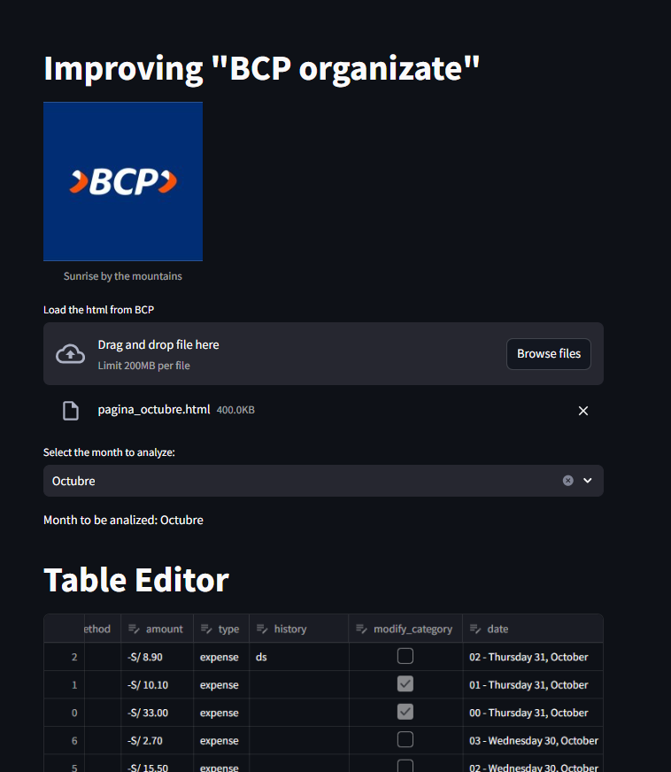
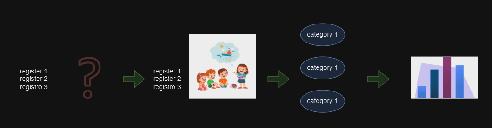
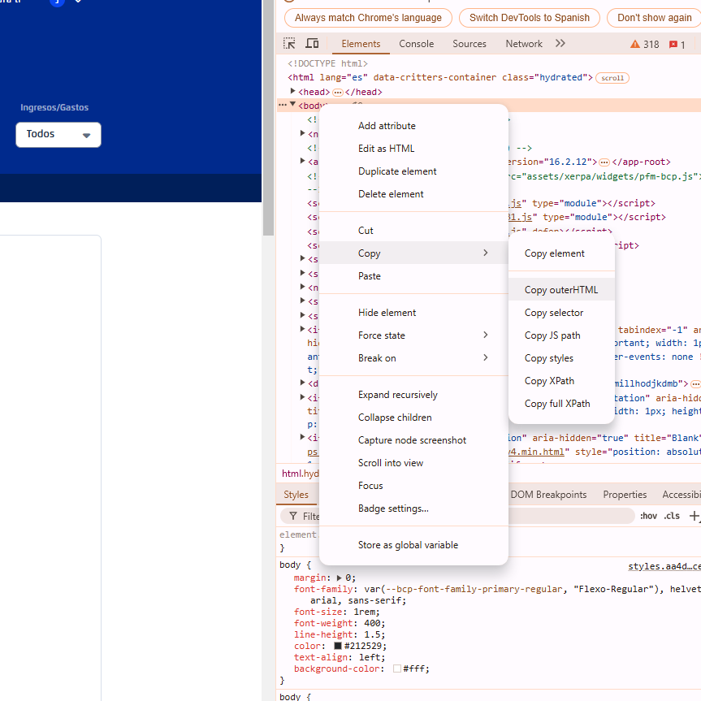
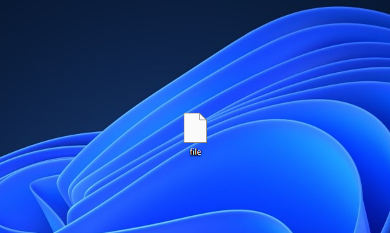
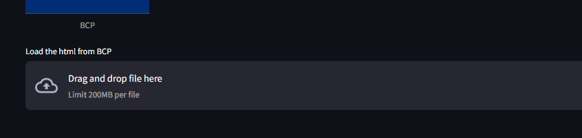

# improving-BCP-organizate


- This platform is designed to improve the app "BCP organizate"
- The data is stored locally, so that you dont have to upload any critical information to any server.
    

# problem


# how it works
- entrar a `organizate BCP`


- Ingresa al mes que quieres analizar. Copiar `Copy OuterHTML` y ponlo en un archivo.



- copy the text inside a file



- drop in the program. This will automatically populate the data.



execute
```
streamlit run app.py 
```

# opinion
If BCP gives aditional information, for example, location and time, it would be better to create the history and clasify the expenses.
