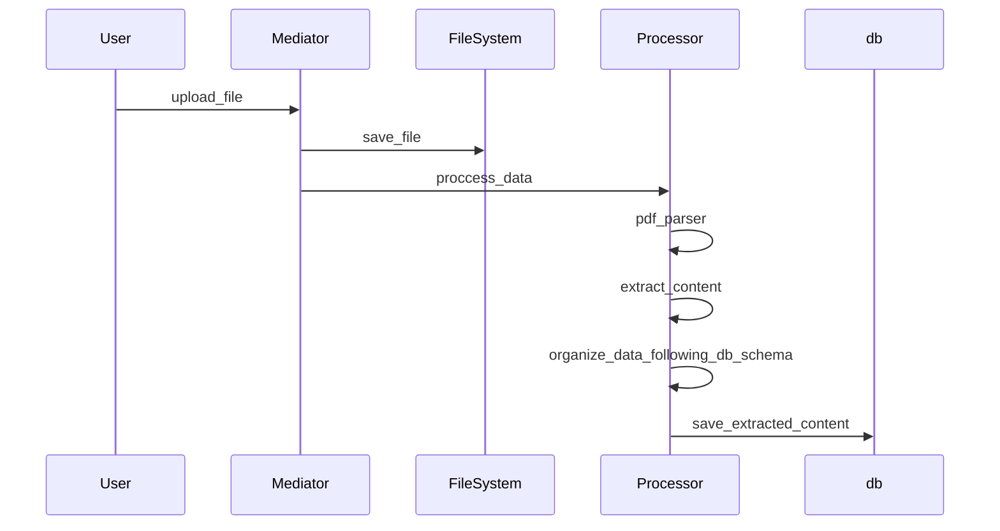
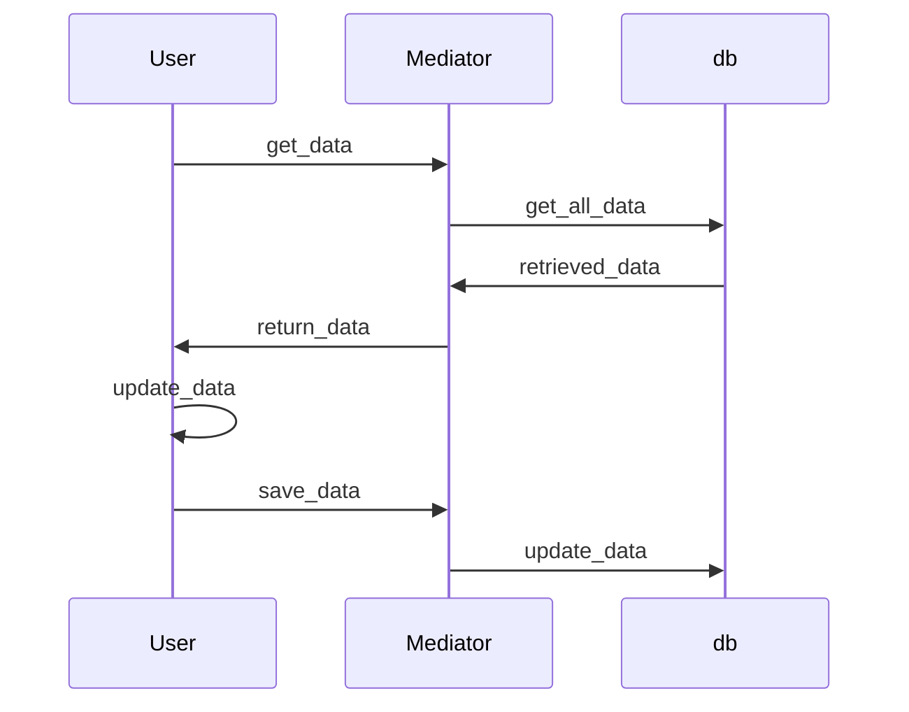
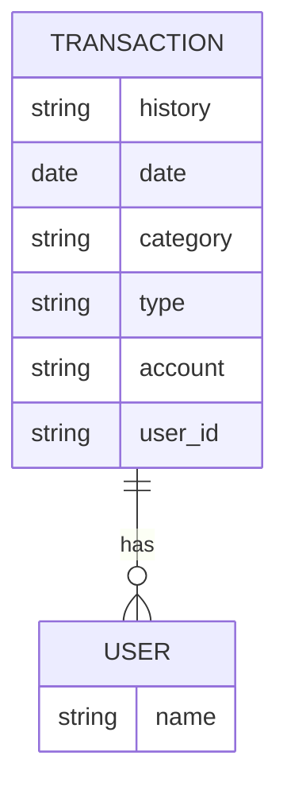

load pdf file

```mermaid
sequenceDiagram
    participant User
    participant Mediator
    participant FileSystem
    participant Processor
    participant db

    User ->> Mediator: upload_file
    Mediator ->> FileSystem : save_file
    Mediator ->> Processor: proccess_data
    Processor ->> Processor: pdf_parser
    Processor ->> Processor: extract_content
    Processor ->> Processor: organize_data_following_db_schema
    Processor ->> db: save_extracted_content
```

update history

```mermaid
sequenceDiagram
    participant User
    participant Mediator
    participant db

    User ->> Mediator: get_data
    Mediator ->> db: get_all_data
    db ->> Mediator: retrieved_data
    Mediator ->> User: return_data
    User ->> User: update_data
    User ->> Mediator: save_data
    Mediator ->> db: update_data
```

```mermaid
erDiagram
    TRANSACTION {
        string history
        date date
        string category
        string type
        string account
        string user_id
    }
    USER{
        string name
    }

    TRANSACTION ||--o{ USER: has

```