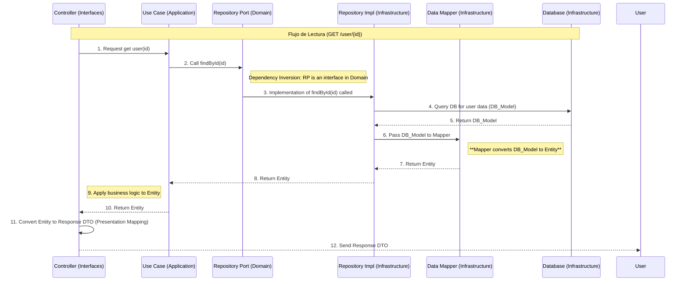

```mermaid
sequenceDiagram
    participant C as Controller (Interfaces)
    participant UC as Use Case (Application)
    participant RP as Repository Port (Domain)
    participant RI as Repository Impl (Infrastructure)
    participant M as Data Mapper (Infrastructure)
    participant DB as Database (Infrastructure)

    Note over C, DB: Flujo de Lectura (GET /user/{id})

    C->>UC: 1. Request get user(id)
    UC->>RP: 2. Call findById(id)
    Note right of RP: Dependency Inversion: RP is an interface in Domain

    RP->>RI: 3. Implementation of findById(id) called
    RI->>DB: 4. Query DB for user data (DB_Model)

    DB-->>RI: 5. Return DB_Model

    RI->>M: 6. Pass DB_Model to Mapper
    Note right of M: **Mapper converts DB_Model to Entity**
    M-->>RI: 7. Return Entity

    RI-->>UC: 8. Return Entity
    Note left of UC: 9. Apply business logic to Entity
    
    UC-->>C: 10. Return Entity

    C->>C: 11. Convert Entity to Response DTO (Presentation Mapping)
    C-->>User: 12. Send Response DTO

```