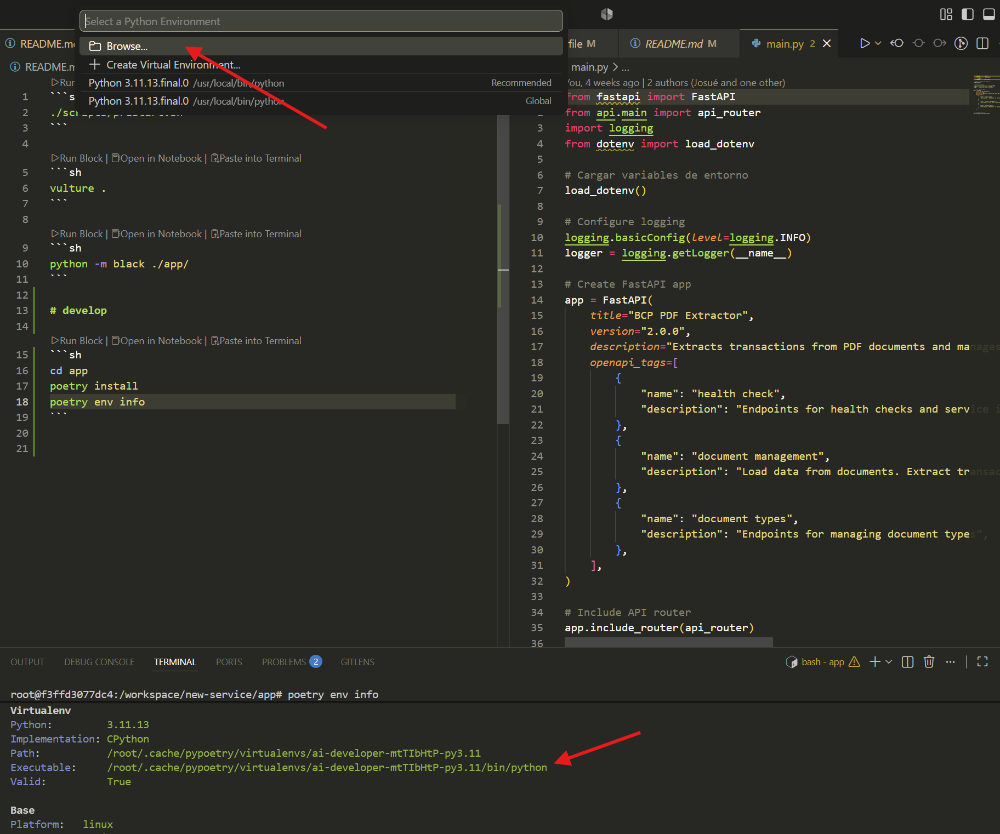

# How to use this container

- Althought the Dockerfile have the `poetry install` instruction, this is applied in another directory. Since we are going to work in this workspace, we need to install the dependancies here.

```sh
poetry install
poetry env info
```

- select the created Python environment



- press `F5` to start FastApi service

```sh
# optional:
# PYTHONPATH="." poetry run fastapi run app/main.py 
```

- run the streamlit frontend

```sh
cd src/Aframework
poetry run streamlit run app.py
```

- be sure you have downloaded the file to analyze in you download directory (in Windows)
- go to [README.md](./REST/README.md) and follow the `final flow` step. This consolites the complete process you need to follow.

### other options

```sh
vulture .
```

```sh
poetry run black .
```
