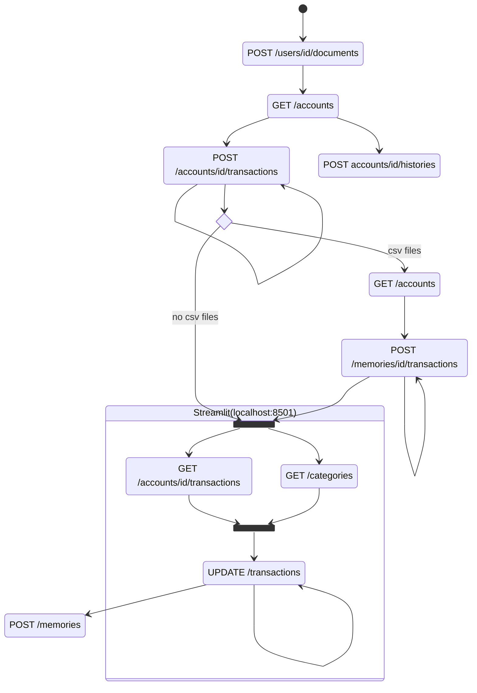

### final flow
this project changed a bit the approach. Before it was supposed to analyze only transactions. Now it is important to analyze account (a place that container money)

- you need to have all the files to be anlized in a singles "documents" directory. Then, use the `Create Documents` endpoint to extract all documents and store them in the db.
- Now you can start creating the transactions, but for that, you need to know the unique idrentifier of the document you want to extract the transaction. Apply `Get Document` and the `Create Transactions` for the specific document you want. Do it with all the documents you want.
- if you have previously saved csv files, you need to import that information. For that, you need to know the unique identifier of the documents already saved on the db. Apply `Get Documents` and then `Import Transactions` for this
- now you are ready to work, but, before updating the transactions, you need to have transactions and the categories abailable. Apply `Get Transactions` and `Get Categories` paralellaly.
- apply `Update Transaction` as many times as you think is necessary
- finally, export all your work to save it in case the db is lost. Apply `Export Transaction`

