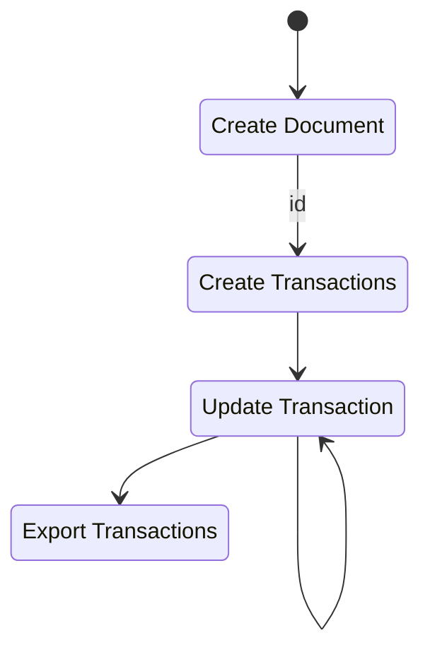
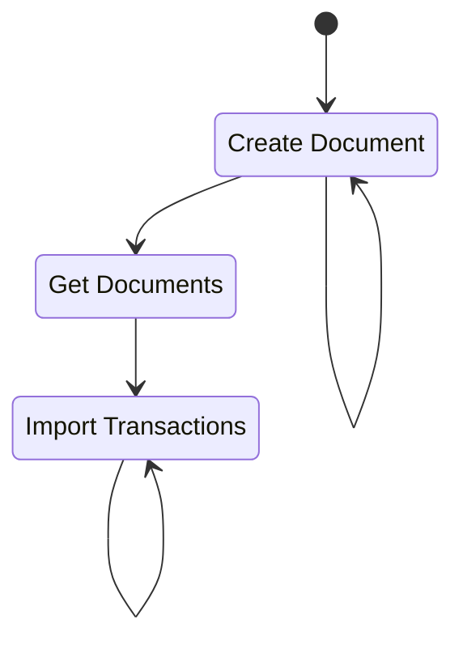
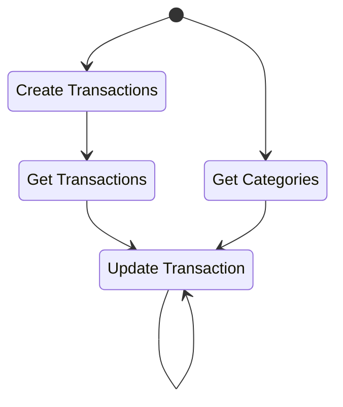
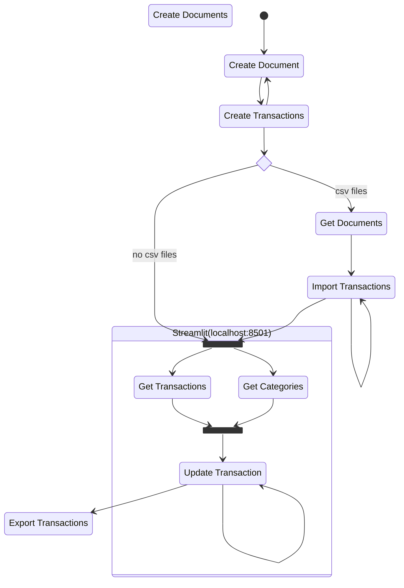

### case 1

when you start the project, you are not going to have nothing, so populate with the files and then export

### case 2

if the project is restarted, and you already have the .csv files, you can use them to update the transaction table. You will have to update all the files that you need to work, then import all the csv files

> TODO: this can be done automatically, just reading all csv files from a directory

### case 3

to update the transactions, you will necesarily must know the category names to select the one that fits that specific transaction. Then take that category id and update the transaction

### final flow

- this project dont work if you dont have transactions in the db. That is why it is important to have apply `Create Document` and `Create Transactions` for all the documents that you have.
- if you have previously saved csv files, you need to import that information. For that, you need to know the unique identifier of the documents already saved on the db. Apply `Get Documents` and then `Import Transactions` for this
- now you are ready to work, but, before updating the transactions, you need to have transactions and the categories abailable. Apply `Get Transactions` and `Get Categories` paralellaly.
- apply `Update Transaction` as many times as you think is necessary
- finally, export all your work to save it in case the db is lost. Apply `Export Transaction`

