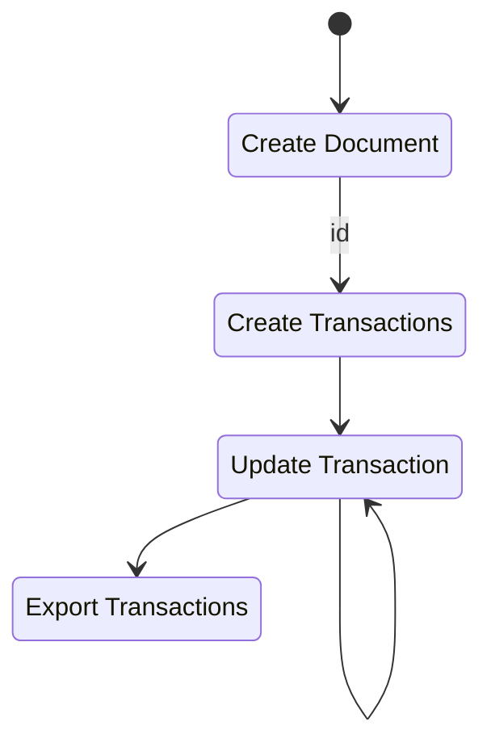
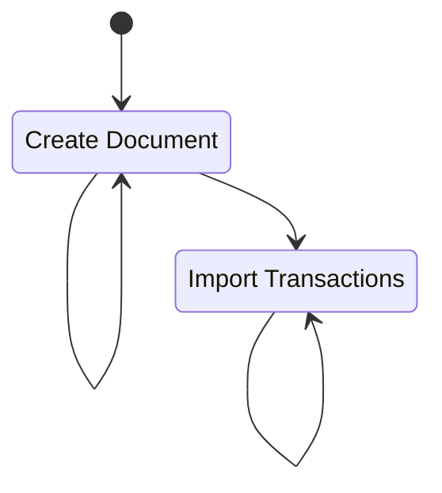
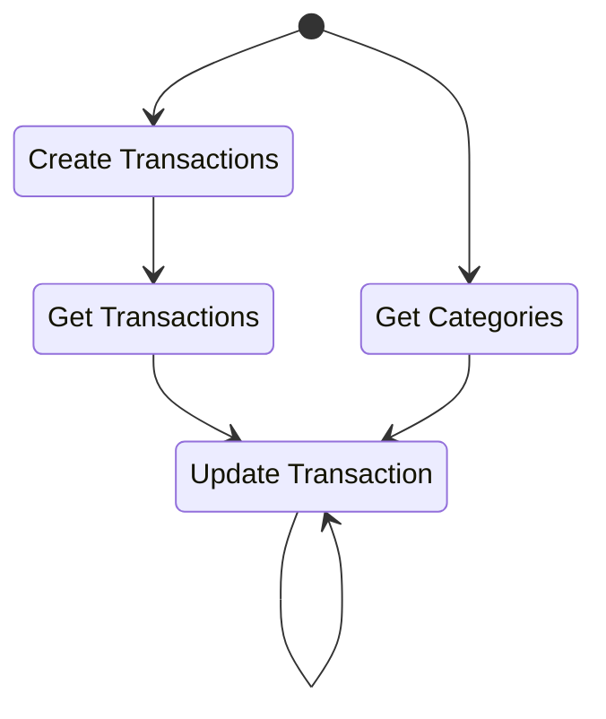

when you start the project, you are not going to have nothing, so populate with the files and then export

if the project is restarted, and you already have the .csv files, you can use them to update the transaction table. You will have to update all the files that you need to work, then import all the csv files

> TODO: this can be done automatically, just reading all csv files from a directory

to update the transactions, you will necesarily must know the category names to select the one that fits that specific transaction. Then take that category id and update the transaction

