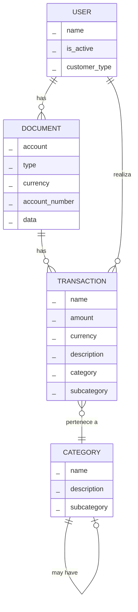

# Diagrama ERD - Sistema de Transacciones BCP

## Relación User - Transaction

```mermaid
erDiagram
    USER {
        _ name
        _ is_active
        _ customer_type
    }

    TRANSACTION {
        _ name
        _ amount
        _ currency
        _ description
        _ category
        _ subcategory
    }

    CATEGORY {
        _ name
        _ description
        _ subcategory
    }


    DOCUMENT {
        _ account
        _ type
        _ currency
        _ account_number
        _ data
    }


    %% Relaciones
    USER ||--o{ DOCUMENT : "has"
    DOCUMENT ||--o{ TRANSACTION : "has"
    USER ||--o{ TRANSACTION : "realiza"
    TRANSACTION }o--|| CATEGORY : "pertenece a"
    CATEGORY ||--o| CATEGORY : "may have"
```
