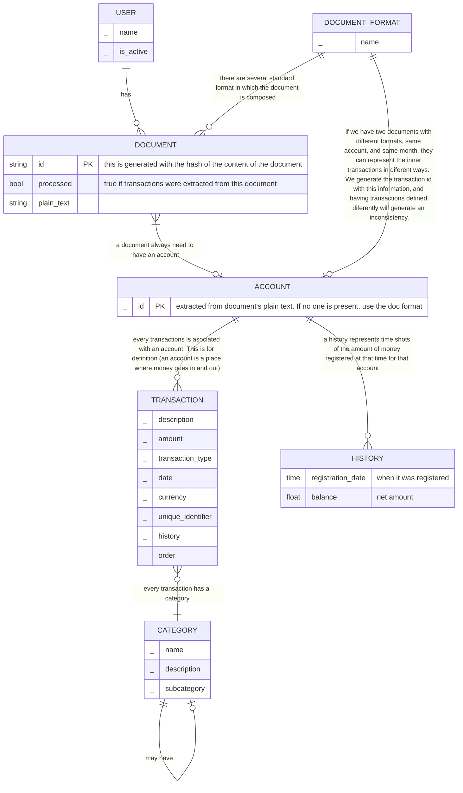

## DB design

This is the design of the application and the database

- Document: the representation of a place that stores money

TODO:
- Transaction should have a connection to User? Remember that this app is intented to be used be just me. This relation doesnt make sense. And, in case we want to relate a transaction to a user, we can clearly do it thought a document. KEEP IT SIMPLE!
- add a new table "Account"
- a Document can have many transactions. A Document can have a single account
- The definition of Account here is "the representation of a place that has money". That is it.
- Following this, Document should be modified (remove balance). Adding hashing have more relevance with this approach

entity definitions:
- DOCUMENT: the representation of a file
- ACCOUNT: a place where money goes in and out
- HISTORY: a registry of the amount of time of an account in a specific time

Software - Ramez Elmasri, Shamkant B. Navathe - Fundamentals of Database Systems.pdf

- transaction_date_old: year, month, day
- transaction_date: year, month, day, hour, minute, second (second is the counter per day)

analisis for transaction unique identifier:

- `{history, transaction_date_old, amount} -> R`: No because we saw in a single document there can be multiple transactions with the same history, transaction_date and amount.
- `order                                   -> R`: No, although this is good, it works only locally (in a document). The transacition "1" from document "a" is not the same as transaction "1" from document "b"
- `order_global                            -> R`: Yes, this is the perfect case, but we saw that there could be a case where the same transaction could appear in diferent documents and they will be considered as different transactions,
- `transaction_date                        -> R`: this is the version of the couning transaction per day. This is good, but we saw that two diferent account could possibly share this key and be refered as the same transaction wrongly.
- `{transaction_date, account_id}          -> R`: Yes, because it is unique enough (so far). There can be multiple transactions on the same time (date + counter), but they will have different accounts.
