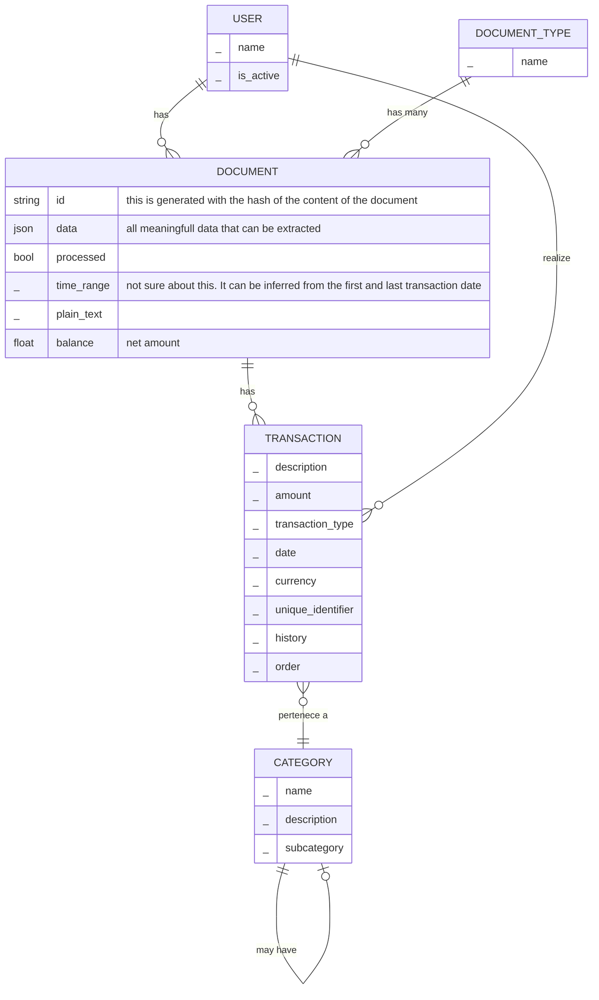

## DB design

This is the design of the application and the database

- Document: the representation of a place that stores money

TODO:
- Transaction should have a connection to User? Remember that this app is intented to be used be just me. This relation doesnt make sense. And, in case we want to relate a transaction to a user, we can clearly do it thought a document. KEEP IT SIMPLE!
- add a new table "Account"
- a Document can have many transactions. A Document can have a single account
- The definition of Account here is "the representation of a place that has money". That is it.
- Following this, Document should be modified (remove balance). Adding hashing have more relevance with this approach

