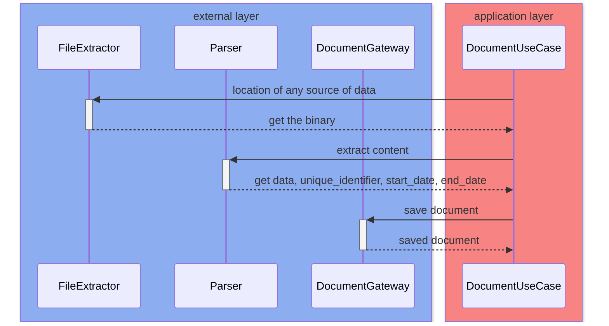
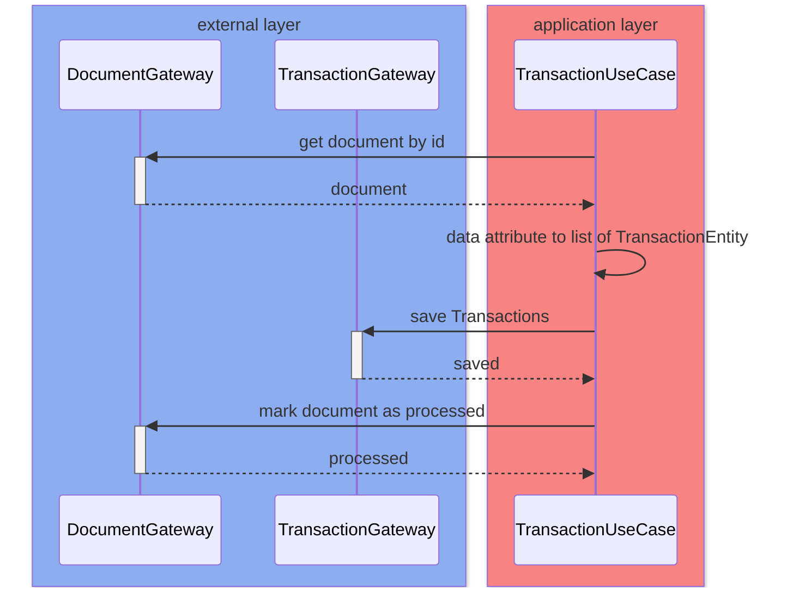

#### CreateDocumentUseCase

```mermaid
sequenceDiagram
    box rgb(141, 173, 241) external layer
    participant FileExtractor
    participant Parser
    participant DocumentGateway
    end

    box rgb(248, 131, 131) application layer
    participant DocumentUseCase
    end
    
    DocumentUseCase->>+FileExtractor: location of any source of data
    FileExtractor-->>-DocumentUseCase: get the binary

    DocumentUseCase->>+Parser: extract content
    Parser-->>-DocumentUseCase: get data, unique_identifier, start_date, end_date

    DocumentUseCase->>+DocumentGateway: save document
    DocumentGateway-->>-DocumentUseCase: saved document


```

#### CreateTransactionsUseCase

```mermaid
sequenceDiagram
    box rgb(141, 173, 241) external layer
    participant DocumentGateway
    participant TransactionGateway
    end

    box rgb(248, 131, 131) application layer
    participant TransactionUseCase
    end
    
    TransactionUseCase->>+DocumentGateway: get document by id
    DocumentGateway-->>-TransactionUseCase: document
    TransactionUseCase->>TransactionUseCase: data attribute to list of TransactionEntity
    TransactionUseCase->>+TransactionGateway: save Transactions
    TransactionGateway-->>-TransactionUseCase: saved
    TransactionUseCase->>+DocumentGateway: mark document as processed
    DocumentGateway-->>-TransactionUseCase: processed

```