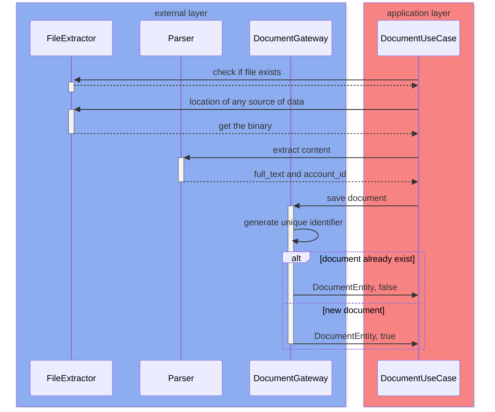
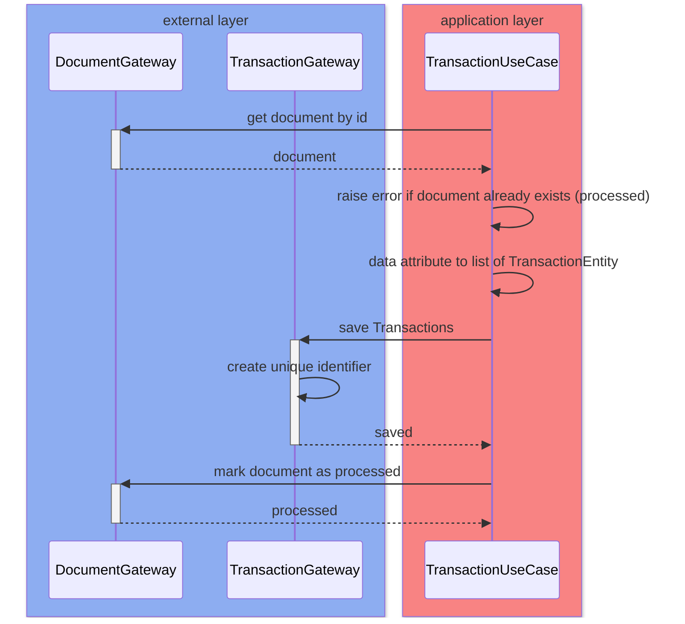

#### CreateDocumentUseCase

```mermaid
sequenceDiagram
    box rgb(141, 173, 241) external layer
    participant FileExtractor
    participant Parser
    participant DocumentGateway
    end

    box rgb(248, 131, 131) application layer
    participant DocumentUseCase
    end

    DocumentUseCase->>+FileExtractor: check if file exists
    FileExtractor-->>-DocumentUseCase: 
    
    DocumentUseCase->>+FileExtractor: location of any source of data
    FileExtractor-->>-DocumentUseCase: get the binary

    DocumentUseCase->>+Parser: extract content
    Parser-->>-DocumentUseCase: full_text and account_id

    DocumentUseCase->>+DocumentGateway: save document
    DocumentGateway->>DocumentGateway: generate unique identifier
    alt document already exist
    DocumentGateway->>DocumentUseCase: DocumentEntity, false
    else new document
    DocumentGateway->>-DocumentUseCase: DocumentEntity, true

    end

```

#### CreateTransactionsUseCase

if a document is already processed, this is nonsense, because it will overlap information already stored

```mermaid
sequenceDiagram
    box rgb(141, 173, 241) external layer
    participant DocumentGateway
    participant TransactionGateway
    end

    box rgb(248, 131, 131) application layer
    participant TransactionUseCase
    end
    
    TransactionUseCase->>+DocumentGateway: get document by id
    DocumentGateway-->>-TransactionUseCase: document
    TransactionUseCase->>TransactionUseCase: raise error if document already exists (processed)
    TransactionUseCase->>TransactionUseCase: data attribute to list of TransactionEntity
    TransactionUseCase->>+TransactionGateway: save Transactions
    TransactionGateway->>TransactionGateway: create unique identifier
    TransactionGateway-->>-TransactionUseCase: saved
    TransactionUseCase->>+DocumentGateway: mark document as processed
    DocumentGateway-->>-TransactionUseCase: processed

```